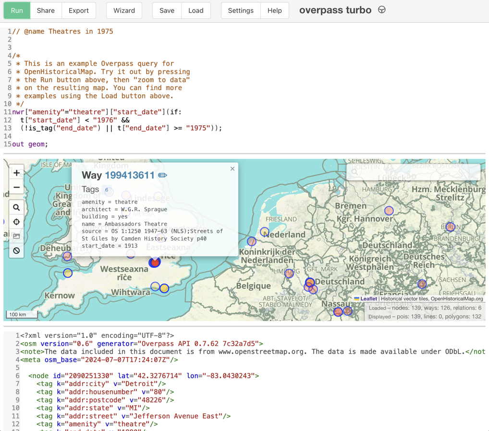

# The OpenHistoricalMap fork of overpass-turbo

This is the OpenHistoricalMap (OHM) fork of [overpass-turbo](https://github.com/tyrasd/overpass-turbo). It's a workbench for crafting & running queries using the [Overpass-API](https://wiki.openstreetmap.org/wiki/Overpass_API/Overpass_QL) and the [OHM extensions](https://wiki.openstreetmap.org/wiki/OpenHistoricalMap/Overpass) to that API. It can be seen in operation at [https://overpass-turbo.openhistoricalmap.org/](https://overpass-turbo.openhistoricalmap.org/) where a number of example queries are included under the **Load** button.

Our philosophy is to stay as close to the upstream version as possible with modifications limited to the time dimension that differentiates OHM from OpenStreetMap (OSM). Most apparent in this code base is our use of [MapLibre GL JS](https://github.com/maplibre/maplibre-gl-js) in combination with [maplibre-gl-leaflet
](https://github.com/maplibre/maplibre-gl-leaflet) to shoehorn OHM-results into a basemap created with Leaflet. We include upstream documentation (README, LICENSE, etc.) in [`./upstream/`](./upstream/) and note OHM-specifics in this README.

## Development

### Quick start

1. `yarn install`
2. `yarn run start` for a Development server listening at http://localhost:5173
3. `yarn run build` for a minified build in `./dist`

### git-branches

As with all OHM projects, issues are filed in [the standalone Issues repository](https://github.com/OpenHistoricalMap/issues). Development is typically carried out on feature branches created from our `main` branch and merged via Pull Requests.

The `master` branch is deprecated and will be removed.

### Gotchas

Upstream `overpass-turbo` makes extensive use of `localStorage`. If your code alterations are not being picked up, you may want to go beyond clearing your browser cache to wiping out `localStorage` using your JavaScript developer tools.

## Translations

overpass-turbo translations that are not specific to OHM–**and that is most of them!**–should be submitted via the upstream system at [Transifex](https://www.transifex.com/projects/p/overpass-turbo). Our limited need for translation is handled by [translatewiki.net](https://translatewiki.net/wiki/Special:Translate/ohm-overpass-turbo).

## Testing

### Black box

- maps should display OHM data using OHM style & OHM attribution
- OSM basemaps should not appear, even momentarily
- query results, permalinks, etc. should link to OHM, not OSM, nodes, ways, and relations
- query results should include OHM specifics such as `start_date`
- **Help** documentation should refer to OHM unless a general OSM document is superior and appropriate

### White box

TBD.

## Continuous integration

Synchronization with `upstream` is carried out daily using a combination of the [`ohm.upstream-sync`](./.github/workflows/ohm.upstream-sync.yml) GitHub action, the [`upstream_sync`](./scripts/upstream_sync.sh) bash script, and `the-sacrifice` branch which is recreated at each run. This is new as of spring 2024 and is very much a work-in-progress.

## Releases

We began to tag [releases](https://github.com/OpenHistoricalMap/overpass-turbo/releases) in spring 2024. Releases are occasional. Our versioning is independent of upstream.

## Deployment to staging and production

As with all OHM projects, deployment to [staging](https://overpass-turbo-staging.openhistoricalmap.org/) and [production](https://overpass-turbo.openhistoricalmap.org/) environments is carried out via sha manipulation to the corresponding branches in the [ohm-deploy](https://github.com/OpenHistoricalMap/ohm-deploy/blob/main/.github/workflows/frontend-overpass.yaml#L36) repository.
